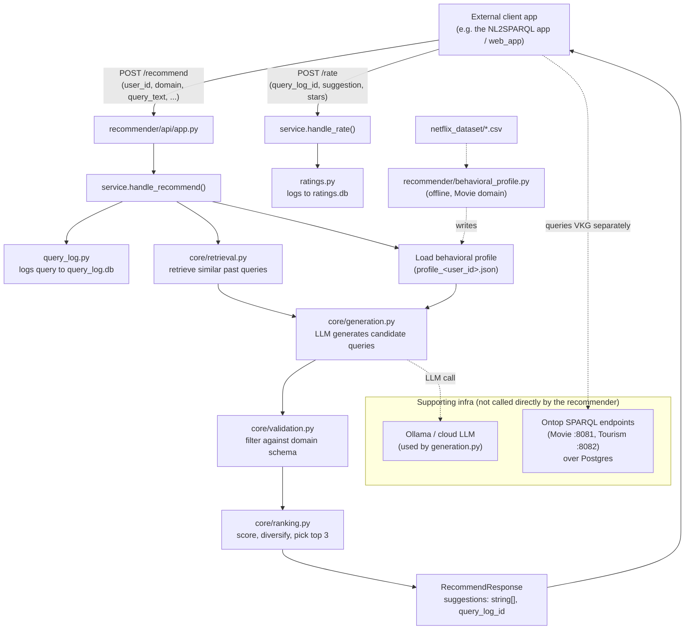

# Query Recommender for Preference-Aware NL Querying over VKGs

This repository contains the implementation for the thesis **"A Query
Recommender for Preference-Aware Natural Language Querying over Virtual
Knowledge Graphs"** (supervisor: Prof. Elisa Quintarelli).

## 1. Project Overview

The starting point is an existing natural-language-to-SPARQL system
(implemented in `web_app/`, built and maintained separately from this
thesis) that lets a user ask questions in plain English and get answers
from a **Virtual Knowledge Graph (VKG)** — a knowledge graph that is not
materialized but generated on the fly from a relational database via
mappings (using [Ontop](https://ontopic.biz/)).

The professor's original request had three parts: (1) domain selection
(Movie vs. Tourism), (2) user selection, and (3) a **query recommender** that
suggests useful follow-up questions after a query is answered. Parts (1) and
(2) are handled by a separate, existing app. **This thesis's entire
deliverable is part (3): a standalone query recommender, exposed as an HTTP
API, that any client application can call.**

**The core idea:** after a user asks a query, the recommender suggests up to
3 follow-up queries. It does this by combining two signals about the user:

- **What they say they want** — inferred from their past search/query text.
- **What they actually do** — inferred from their real interaction/watch
  behavior.

These two signals often diverge (a user might *search* for "action movies"
but mostly *watch* documentaries). The recommender uses an LLM to generate
candidate follow-up queries grounded in both signals, filters out
suggestions that don't fit the domain's schema, and ranks/diversifies the
result down to 3 suggestions.

The recommender is domain-agnostic in principle but the **behavioral
profiling signal is currently implemented for the Movie domain only**
(built from a Netflix-style synthetic dataset). The Tourism domain has no
per-user behavioral data by design, so it is catalog-query-only.

## 2. Project Structure

```
recomendation_system/
├── main.py                    # Entry point: starts the recommender API (uvicorn)
├── call_recommender.py        # Example client that calls POST /recommend, then POST /rate
├── docker-compose.yml         # Infra: Postgres + Ontop (VKG endpoints) + Ollama (local LLM)
│
├── recommender/                # <-- THE THESIS DELIVERABLE
│   ├── api/
│   │   ├── app.py              # FastAPI app: GET /health, POST /recommend, POST /rate
│   │   ├── schemas.py          # Request/response models
│   │   └── service.py          # handle_recommend()/handle_rate(): orchestrate the pipeline + feedback
│   ├── core/
│   │   ├── retrieval.py        # Finds the user's similar past queries (embeddings)
│   │   ├── generation.py       # Builds the LLM prompt, generates candidate suggestions
│   │   ├── validation.py       # Filters candidates against the domain schema
│   │   └── ranking.py          # Scores, diversifies, and picks the top 3 suggestions
│   ├── behavioral_profile.py   # Offline: builds "stated vs. actual" interest profiles
│   ├── query_log.py            # SQLite-backed log of every query received
│   ├── ratings.py              # SQLite-backed store of live star ratings (1-5) on suggestions
│   ├── evaluation/             # Offline ablation (history vs. history+behavior) + live ratings_summary.py
│   └── output/                 # Generated artifacts: query_log.db, ratings.db, behavioral_profiles/*.json
│
├── docker/                     # Docker setup docs and support files for the VKG stack
├── netfilx_sparql/             # Movie domain: OWL ontology + OBDA mappings for Ontop
├── netflix_dataset/            # Movie domain: synthetic Netflix-style CSV dataset
├── Verona_Tourism_Ontop/       # Tourism domain: real Verona tourism DB dump + ontology
├── web_app/                    # Pre-existing NL2SPARQL app — reused, not part of this thesis
├── profile_geneartion/         # Earlier standalone profiling prototype — not used by recommender/
├── docs/                       # Thesis planning docs, phase reports, LaTeX report, diagrams
└── .env.example                # Required environment variables (LLM provider, DB passwords, etc.)
```

**Notes on structure:**
- `recommender/` is the only package this thesis implements and evaluates.
- `web_app/` is the pre-existing NL2SPARQL pipeline the recommender is
  designed to plug into; it is reused as-is, not built as part of this thesis.
- `netfilx_sparql/`, `netflix_dataset/`, `Verona_Tourism_Ontop/`, and
  `docker-compose.yml` together stand up the two VKGs (Movie, Tourism) that
  `web_app/` queries. The recommender itself never talks to these directly —
  it only receives already-generated SPARQL/results as optional logged
  context.
- `profile_geneartion/` is an earlier, standalone Italian-language prototype
  for behavioral profiling. It has its own (different) JSON schema and its
  own Streamlit dashboard, but it is **not imported or used** by
  `recommender/` — the actual behavioral profiling used by the API lives in
  `recommender/behavioral_profile.py`.

## 3. Sequence

The diagram below shows the overall sequence of the system: a client
application sends a user's query and context to the recommender API, which
logs it, retrieves relevant history, consults the user's behavioral profile,
asks an LLM for candidate follow-up queries, validates and ranks them, and
returns up to 3 suggestions.



## 4. Action / Request Flow

Every call to `POST /recommend` is orchestrated by
`recommender/api/service.py::handle_recommend`, in this order:

1. **Log the query** — `query_log.py` writes the incoming request to
   `recommender/output/query_log.db` (SQLite), unconditionally.
2. **Retrieve similar past queries** — `core/retrieval.py` embeds the user's
   past queries and the current one (SentenceTransformer
   `all-mpnet-base-v2`) and returns the top-3 most similar past queries.
3. **Load the behavioral profile** — if one exists for this user
   (`recommender/output/behavioral_profiles/profile_<user_id>.json`), it is
   loaded as additional context.
4. **Generate candidates** — `core/generation.py` builds a prompt from the
   current query + similar history + behavioral profile, and calls an LLM
   (provider selected via `RECOMMENDER_LLM_PROVIDER`, e.g. local Ollama or
   Gemini/OpenAI) to generate up to 5 candidate follow-up queries. If this
   fails, the request still succeeds with an empty suggestion list.
5. **Validate against the schema** — `core/validation.py` keeps only
   candidates whose embedding is close enough to a known schema class for
   the domain, filtering out clearly off-topic or degenerate suggestions.
6. **Rank and diversify** — `core/ranking.py` scores the surviving
   candidates by overlap with the user's history and behavioral profile,
   then picks the top 3 while penalizing redundancy between them.
7. The response returns `suggestions: string[]` (0–3 items) plus `query_log_id`, the id of the
   row written in step 1 — the caller passes this back into `POST /rate` (below) to tie a
   rating to the request that produced the rated suggestion.



## 4a. Live Rating Flow

`POST /rate` (`recommender/api/service.py::handle_rate`) is a separate, much simpler endpoint:
it takes `user_id`, `domain`, `suggestion`, `stars` (1-5, Pydantic-validated), and the
`query_log_id` from a prior `/recommend` call, and appends one row to
`recommender/output/ratings.db` via `ratings.py::add_rating`. No pipeline runs — it's a pure
feedback sink. `recommender/evaluation/ratings_summary.py` reads that table back and reports
mean stars/count overall, per domain, and per suggestion — a live, user-facing evaluation
channel requested by the professor, complementary to the offline ablation also under
`recommender/evaluation/`.

## 5. Behavior / Profile Flow

Behavioral profiles capture the gap between what a user *says* they want and
what they *actually* engage with, and are built **offline**, ahead of any
API call, by `recommender/behavioral_profile.py`:

1. Reads `netflix_dataset/movies.csv`, `watch_history.csv`, and
   `search_logs.csv`.
2. Treats search queries as the user's **stated** interest (matched against
   a genre/content-type/country vocabulary).
3. Treats watch history (weighted by completion percentage) as the user's
   **actual** interest.
4. Temporally joins searches to subsequent watches (within a 7-day window)
   to see whether what was watched matched what was searched for.
5. Computes each user's top stated vs. top actual categories and their
   overlap ("divergence"), and writes one profile JSON file per user to
   `recommender/output/behavioral_profiles/`.

At request time, the API simply loads the precomputed profile for the
requesting `user_id` (step 3 in the Request Flow above) — profiles are not
recomputed per request.



## 6. Overall Architecture



The recommender never queries the VKGs directly — it only receives
already-generated SPARQL/result context as optional fields on the request.
The VKG/Ontop/Postgres infrastructure and the LLM backend (local Ollama by
default, to avoid cloud API quota limits) are supporting services, defined
in `docker-compose.yml`.

## 7. Running the System

```bash
# 1. Configure environment
cp .env.example .env

# 2. Start supporting infrastructure (Postgres + Ontop VKGs + Ollama)
docker compose up -d

# 3. Start the recommender API (http://127.0.0.1:8000, docs at /docs)
python main.py

# 4. Try it out (calls POST /recommend, then POST /rate on its first suggestion)
python call_recommender.py

# 5. Summarize collected star ratings
python -m recommender.evaluation.ratings_summary
```

See `docker/README.md` for full infrastructure setup details (JDBC driver
mount, data restore, verification queries).

## 8. Further Documentation

This README is a summary. For full detail see:
- `docs/THESIS_PROJECT_PLAN.md` — full scope, phases, and architecture rationale.
- `docs/PHASE0_PHASE1_IMPLEMENTATION.md` … `docs/PHASE5_IMPLEMENTATION.md` — per-phase implementation notes.
- `docs/report/main.tex` (+ `sections/`) — the full thesis report.
