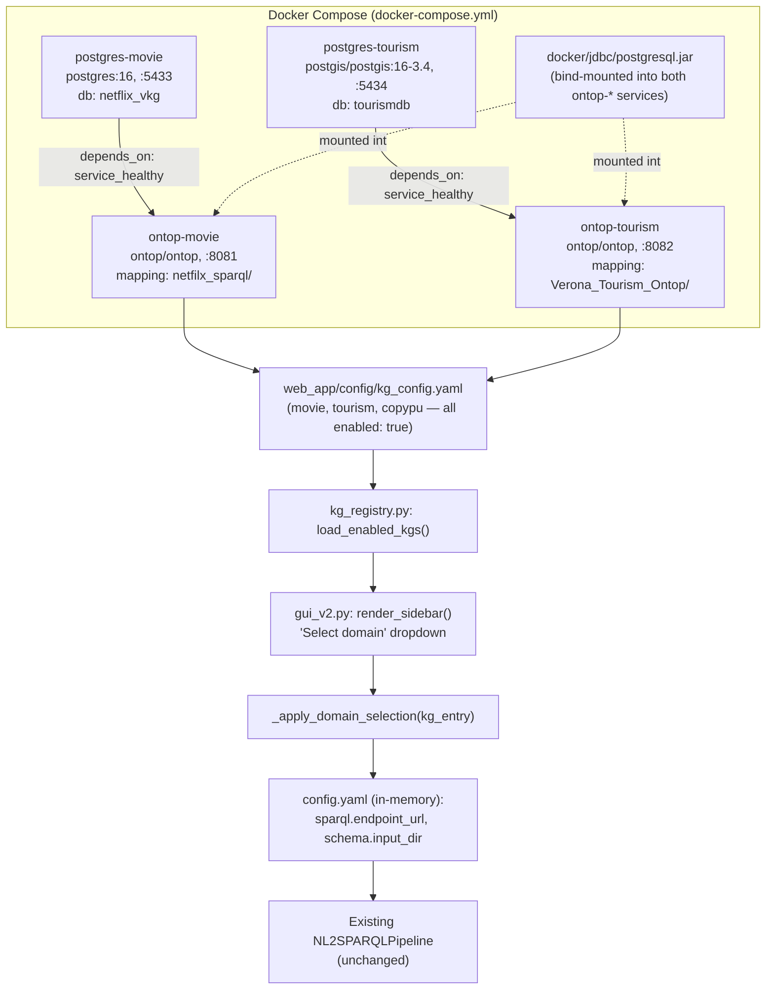

# Phase 0 & Phase 1 Implementation Documentation

**Status:** both phases complete and verified · **Scope:** infrastructure prep (Phase 0) and
domain-selection UX (Phase 1) from [`THESIS_PROJECT_PLAN.md`](THESIS_PROJECT_PLAN.md) §7.

> **Scope note (2026-07-25):** after this work was completed, the thesis scope was narrowed
> (`THESIS_PROJECT_PLAN.md` §2a) to the query recommender (Phase 3/4) as a standalone API only.
> Domain selection and user selection — items (1)/(2), i.e. everything this document covers — are
> **not thesis deliverables**; they're owned by a separate app built by two bachelor students.
> Everything below is retained and kept running as an **internal dev/test harness**: the two live
> Movie/Tourism VKGs and the GUI domain switcher exist so the recommender (Phase 3 onward) can be
> built and demoed against real schemas/data without depending on the external app's timeline. No
> technical work described here was undone or is being redone — only its role changed, from
> "thesis deliverable" to "supporting infrastructure."

This document is a standalone implementation record for the two completed phases — what was
built, how it works, what broke during bring-up and how it was fixed, and how each piece was
verified. It exists separately from the roadmap document so the "what happened" record doesn't
get mixed in with forward-looking planning text. For Phase 2 onward, see the roadmap.

---

## 1. Overview

Phase 0 stood up two independent Virtual Knowledge Graphs (VKGs) — **Movie** and **Tourism** —
each behind its own Ontop instance, sourced from real relational data (a synthetic Netflix-shaped
dataset for Movie, a real 293MB Verona tourism DB dump for Tourism). Phase 1 wired a **domain
selector** into the existing Indeewari NL2SPARQL Streamlit GUI so a user can pick which VKG to
query, replacing the app's previous single-KG wiring.

Neither phase touches the NL2SPARQL pipeline's core logic (schema formatting → class/property
extraction → entity linking → SPARQL generation → execution). Phase 0 adds new data sources
behind the same SPARQL-endpoint abstraction the pipeline already used; Phase 1 adds a selector
that reconfigures which endpoint/schema the existing pipeline points at.

---

## 2. Architecture



---

## 3. Phase 0 — Data & infrastructure prep

### 3.1 Docker Compose topology

`docker-compose.yml` (repo root) defines 4 services:

| Service | Image | Port | Role |
|---|---|---|---|
| `postgres-movie` | `postgres:16` | `5433:5432` | Movie relational DB (`netflix_vkg`) |
| `postgres-tourism` | `postgis/postgis:16-3.4` | `5434:5432` | Tourism relational DB (`tourismdb`), needs PostGIS for `geometry`/`geography` columns |
| `ontop-movie` | `ontop/ontop` | `8081:8080` | Ontop VKG endpoint over the Movie mapping |
| `ontop-tourism` | `ontop/ontop` | `8082:8080` | Ontop VKG endpoint over the Tourism mapping |

Both `ontop-*` services declare `depends_on: <their postgres>: condition: service_healthy`, so
Ontop only starts once its database has passed its healthcheck (`pg_isready`; the Tourism
healthcheck uses a longer interval/retry budget — 10s/5s/60 retries vs. 5s/5s/20 — to accommodate
the slower PostGIS restore). Both Ontop services also mount `docker/jdbc:/opt/ontop/jdbc:ro` (see
§3.3) and set `ONTOP_CORS_ALLOWED_ORIGINS: "*"`; database passwords are injected via
`${POSTGRES_MOVIE_PASSWORD}` / `${POSTGRES_TOURISM_PASSWORD}` from a gitignored root `.env`
(template: `.env.example`).

### 3.2 Movie side

`postgres-movie` is initialized by `docker/movie/init.sql`, which creates 6 tables (`movies`,
`users`, `watch_history`, `search_logs`, `reviews`, `recommendation_logs`) loaded from the
`netflix_dataset/` CSVs (mounted read-only at `/csv`). **No table has a `PRIMARY KEY`** — the
source dataset contains genuine duplicate id values in every table (e.g. duplicate `movie_id`s
across ~40 of 1040 rows); plain (non-unique) indexes are used instead where lookups are needed.

Verified row counts match the CSVs exactly:

| Table | Rows |
|---|---|
| `movies` | 1,040 |
| `users` | 10,300 |
| `watch_history` | 105,000 |
| `search_logs` | 26,500 |
| `reviews` | 15,450 |
| `recommendation_logs` | 52,000 |

**OBDA/ontology fixes applied** (`netfilx_sparql/`):
- `netflix_ontology.obda`'s `watch-details` mapping was fixed — it originally selected a
  non-existent `watch_duration` column; corrected to the real column, `watch_duration_minutes`.
- The mapping set was extended from the original set up to **17 mappings total**, adding
  coverage for columns needed by the Phase 3 search→watch temporal join: `search-details`
  (`searchDate`), `watch-session-details` (`watchDate`, `action`, `deviceType`),
  `recommendation-date` (`recommendationDate`), and a new `watch-session-user` mapping for a new
  object property, `watchedByUser` (`WatchSession → User`, previously missing despite
  `WatchSession → Movie`/`Device` existing).
- `netflix_ontology.owl` was updated in lockstep — the new `watchedByUser` object property plus
  datatype properties `watchDate`, `action`, `deviceType`, `searchDate`, `recommendationDate` were
  added (each marked with an explanatory XML comment).

### 3.3 Tourism side

`postgres-tourism` is initialized by `docker/tourism/restore.sh`, which first creates the
`postgis` extension, then runs `pg_restore --no-owner --jobs=2` against the mounted 293MB
`Verona_Tourism_Ontop/tourismdb_jan 1.backup`. The script tolerates `pg_restore`'s common
non-fatal warning exit codes (`set +e` plus explicit status handling) rather than treating them
as failures.

Verified row counts match the source backup exactly:

| Table | Rows |
|---|---|
| `art` | 41 |
| `event` | 1,416 |
| `calendar` | 10,640 |
| `location` | 1,600 |

**OBDA fix applied** (`Verona_Tourism_Ontop/art_all.obda`): the two mappings referencing a
non-existent `art_images` table (`art-image-mapping`, `art-to-image-mapping`) were **dropped
entirely** — decided with the user as out of scope for the thesis demo rather than reconstructing
the table from the legacy `oldapp.art_media` schema. 14 mappings remain
(`status-mapping`, `art-mapping`, `art-category-mapping`, `art-category-art-mapping`,
`tour-type-mapping`, `tour-mapping`, `tour-art-mapping`, `event-mapping`,
`event-category-mapping`, `event-category-event-mapping`, `calendar-mapping`,
`location-mapping`, `event-to-location-mapping`, `event-to-calendar-mapping`).
`ex:ArtImage`/`ex:hasImage`/`ex:imageOfArt` remain declared in `art_all.ttl` but are now
unpopulated/unused.

**Explicit scope decision (carried forward from Phase 0 into later phases)**: Tourism's only
large behavioral table, `log_vc` (4.4M rows of anonymous VeronaCard tap-in visits, not keyed to a
named user), is **not mapped into the ontology**. Tourism stays catalog-query-only for this
thesis; the Movie domain carries all user-selection and behavior-aware work.

### 3.4 Bugs found during bring-up (not anticipated by the original plan)

1. **Missing JDBC driver.** The `ontop/ontop` image ships with no JDBC drivers under
   `/opt/ontop/jdbc/`. Both `ontop-*` services failed on startup with
   `Cannot load the driver: org.postgresql.Driver`. Fixed by downloading
   `postgresql-42.7.4.jar` into a new `docker/jdbc/` directory (gitignored via
   `docker/jdbc/*.jar`; fetch command documented in `docker/README.md`) and bind-mounting it into
   both containers at `/opt/ontop/jdbc` in `docker-compose.yml`. Note: the file is saved locally
   as `docker/jdbc/postgresql.jar` (the download URL is versioned, the local filename isn't).

2. **Ontop's `.obda` parser rejects free-standing `#` comments.** Not just inside the `[[ ]]`
   mapping block — anywhere in the file. An explanatory comment about the dropped
   `art-image-mapping`/`art-to-image-mapping` mappings had to be removed from
   `Verona_Tourism_Ontop/art_all.obda`; the same information is preserved here (§3.3) and in
   `docker/README.md`'s "Known limitations" section instead.

### 3.5 Credential hygiene

`netfilx_sparql/netflix_ontology.properties` and `Movie/movie_project.properties` (both legacy,
unused by the Docker Compose stack) now carry `jdbc.password=CHANGEME` placeholders instead of
plaintext passwords. Real credentials for the running stack live only in a gitignored root
`.env` (`POSTGRES_MOVIE_PASSWORD`, `POSTGRES_TOURISM_PASSWORD`), templated in `.env.example`.

### 3.6 Verification performed

- All row counts above confirmed exactly against source CSVs/backup.
- Two SPARQL smoke tests (documented with exact `curl` commands in `docker/README.md`):
  - `:8081/sparql` — returns real movie titles.
  - `:8082/sparql` — returns all 6 `ArtCategory` names, including **"Chiese"** (churches),
    matching the professor's example question ("Churches in Verona").

---

## 4. Phase 1 — Domain selection UX

### 4.1 KG registry

`web_app/config/kg_config.yaml` lists 3 knowledge graphs, each with
`name/file/sparql_endpoint/source_type/enabled/notes`, all currently `enabled: true`:

| Name | Schema file | Endpoint | `source_type` |
|---|---|---|---|
| `copypu` | `data/input/copypu.ttl` | `http://localhost:8080/sparql` | `local_rdf` |
| `movie` | `netfilx_sparql/netflix_ontology.owl` | `http://localhost:8081/sparql` | `sparql_endpoint` |
| `tourism` | `Verona_Tourism_Ontop/art_all.ttl` | `http://localhost:8082/sparql` | `sparql_endpoint` |

A commented-out `dbpedia` stub is present but disabled. This file was previously just a
registry with no code reading it — Phase 1 added the first consumer.

### 4.2 `kg_registry.py` (new file)

`web_app/nl2sparql/kg_registry.py` exports `load_enabled_kgs(config_path="config/kg_config.yaml")`,
which reads the YAML and returns the `knowledge_graphs` entries filtered to `enabled: true`, in
file order (empty list if the file is missing).

### 4.3 GUI wiring (`gui_v2.py`)

- **`render_sidebar()`** adds a "🌐 Domain" section: a `st.selectbox("Select domain", ...)`
  populated from `load_enabled_kgs()`. On change, it updates
  `st.session_state.active_domain`, calls `_apply_domain_selection`, and reruns the app.
- **`_apply_domain_selection(kg_entry)`** reconfigures the in-memory pipeline config:
  - Sets `schema_path` to `data/output/{name}_mschema.json`.
  - If `source_type == "sparql_endpoint"`: points `sparql.endpoint_url` at the registry's
    endpoint and sets `default_graph = None`.
  - Otherwise (`local_rdf`, e.g. `copypu`): restores the original `config.yaml` SPARQL settings,
    cached in `st.session_state["_default_sparql_config"]` on first load.
  - Also updates `config["kg"]["name"]`.
- **`_derive_kg_name_from_schema_path()`** infers a KG name from a schema path by stripping the
  `_mschema.(json|toon)` suffix.
- **Per-domain example questions**: `examples_by_domain` (a `{kg_name: [examples]}` map in
  `main()`) replaced the previous hardcoded maritime-only example buttons — Tourism's examples
  include the professor's own "Churches in Verona".

### 4.4 Domain-routing keyword fallback (`utils.py`)

`detect_schema_from_question()`'s keyword dictionary was extended with entries for the two new
domains, used as a fallback alongside the explicit UI selector (not a replacement for it):

```python
"movie_mschema.json": ["movie", "film", "watch", "genre", "director", "review",
                        "actor", "recommendation", "subscription", "streaming"],
"tourism_mschema.json": ["church", "chiese", "verona", "tour", "event", "art",
                          "museum", "poi", "attraction", "sightseeing"],
```

### 4.5 The SHACL gap and its fix (Movie-side only)

`web_app`'s only schema loader, `SHACLSchemaParser.parse()` (`nl2sparql/schema_parser.py`),
drives entirely off `sh:NodeShape` triples (`g.subjects(RDF.type, self.SH.NodeShape)`) — there is
**no fallback** that walks plain `rdfs:domain`/`rdfs:range` declarations. `netflix_ontology.owl`
is plain RDF/XML OWL with zero SHACL triples, so feeding it directly produced a silently empty
schema.

Fixed with a new one-time script, `netfilx_sparql/generate_shacl_shapes.py`: for every
`owl:Class`, it emits an `sh:NodeShape` + `sh:targetClass`; for every property whose
`rdfs:domain` matches that class, it emits an `sh:property` blank node — using
`sh:class <range> + sh:nodeKind sh:IRI` for object properties, or `sh:datatype <range>` for
datatype properties. Output: `netfilx_sparql/netflix_shapes.ttl` (11 `sh:NodeShape` triples,
one per class: `Country`, `Device`, `Genre`, `Language`, `Movie`, `Recommendation`, `Review`,
`Search`, `SubscriptionPlan`, `User`, `WatchSession`).

`Verona_Tourism_Ontop/art_all.ttl` already had SHACL shapes embedded (one `sh:NodeShape` per
class, e.g. `ex:ArtShape`) and needed no equivalent step.

### 4.6 Generated m-schema artifacts

Both domains' m-schema JSON (the LLM-readable schema format the pipeline's later stages consume)
were generated via `pipeline.extract_schema()` and committed under `web_app/data/output/`:

- `movie_mschema.json` — 11 classes (matching the 11 SHACL shapes above). 4 classes
  (`Country`, `Device`, `Genre`, `Language`, `SubscriptionPlan`) carry only a `class_label`, no
  `properties`, since nothing else targets them as an object-property range.
- `tourism_mschema.json` — 7 classes (e.g. `example:Art`, `example:ArtCategory`), unchanged
  from the already-SHACL-shaped source.

### 4.7 Verification performed

- Direct SPARQL queries against both live Ontop endpoints confirmed the generated shapes'
  property IRIs match real data (`ex:title` on `ex:Movie` returns real titles; the Tourism
  `ArtCategory` query still returns "Chiese").
- Ran the real `NL2SPARQLPipeline.answer_question()` (embedding-based extraction stage, LLM
  stages disabled — no API key configured in this environment) against both schemas: correctly
  identified `Movie`/`Genre` + `hasGenre`/`title`/`releaseYear` for *"What movies have the genre
  Action?"*, and `Art`/`ArtCategory`/`Event`/… + `artname_it`/etc. for *"Churches in Verona"*.
- Exercised `_apply_domain_selection()` directly for all 3 registry entries: `movie`/`tourism`
  correctly point `sparql.endpoint_url` at `:8081`/`:8082` with `default_graph: null`; `copypu`
  correctly restores the original Virtuoso `endpoint_url`/`default_graph` from `config.yaml`.
- Streamlit itself was started and confirmed reachable (`streamlit run nl2sparql/gui_v2.py`).
  Note: this machine has TCP ports 8405–8704 excluded by Windows/Hyper-V, covering Streamlit's
  entire default 8500s range — use a port outside that range if 8501 fails with "port not
  available". Full manual click-through in a browser was not performed in-session.

---

## 5. Known limitations / carried-forward open items

- **Neither phase is a thesis deliverable as of 2026-07-25** (see scope note above) — both are
  kept solely so the recommender has real schemas/data/GUI to develop and demo against.
- **Tourism has no per-user behavioral signal**, by explicit design decision (§3.3), not
  oversight — this bounds what's possible for later phases' "user selection" and "behavior-aware
  recommendation" work on the Tourism side specifically. This is also why Phase 3 onward builds
  its behavioral-profile/recommender work on the Movie domain only.
- **`kg_config.yaml` is still only fully consumed by the GUI's sidebar selector** — no other
  part of `web_app` reads it yet; runtime KG switching happens through the in-memory
  `config.yaml` values that `_apply_domain_selection()` sets.
- Manual full click-through of the domain switch in an actual browser session was not performed
  in-session (verified via direct function calls and a reachability check instead).

---

## 6. Pointers

- [`THESIS_PROJECT_PLAN.md`](THESIS_PROJECT_PLAN.md) — full roadmap; §2a records the 2026-07-25
  scope narrowing referenced above.
- [`PHASE3_IMPLEMENTATION.md`](PHASE3_IMPLEMENTATION.md) — the behavioral preference profile
  (Phase 3), the first piece of the actual thesis deliverable, built on top of this harness's
  Movie VKG/dataset.
- `docker/README.md` — day-to-day setup/ops commands: bringing the stack up, the JDBC driver
  fetch command, and both SPARQL smoke tests.
