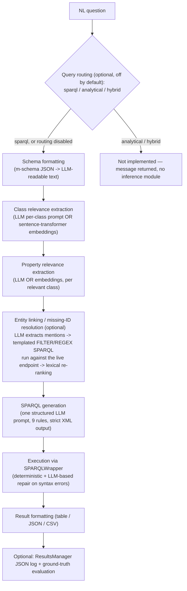
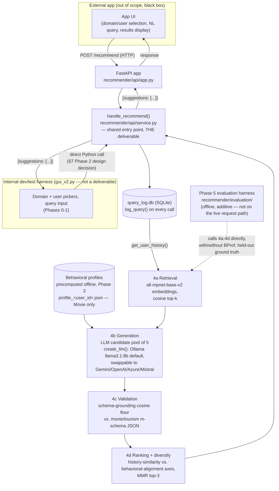

# Thesis Project Plan: A Query Recommender for Preference-Aware Natural Language Querying over Virtual Knowledge Graphs

**Status:** draft roadmap · **Owner:** Narges · **Supervisor:** Prof. Elisa Quintarelli
**Scope (updated 2026-07-25):** the thesis contribution is the **query recommender model
itself**, delivered as a **standalone API** any app can call. Domain selection and user selection
(items (1)/(2) below) are handled by a separate, existing app — they are **not** a thesis
deliverable. The multi-domain VKG work already done in this repo (`web_app`, Phases 0-1) is kept
only as an **internal dev/test harness** for building and validating the recommender in isolation
— see §2a.

---

## 1. Executive summary

The underlying architecture lets a non-expert user type a natural-language question (e.g.
*"Churches in Verona"*) and get results retrieved from a Virtual Knowledge Graph (VKG) via an
LLM-driven NL2SPARQL pipeline. The professor's email asks for three extensions, in increasing
order of research weight:

1. **Domain selection** — generalize the app so a user can choose *which* VKG to query (e.g.
   Movie vs. Tourism) instead of the app being wired to one dataset.
2. **User selection instead of login** — let the user pick *who they are* (a persona/user ID)
   so the system can reason about that user's preferences, without building real
   authentication.
3. **The actual thesis contribution** — a **query recommender**: after the system answers a
   query, it should propose 3 follow-up query suggestions. The key research idea is that a
   user's *stated* queries and their *real* interaction behavior often diverge (a user types
   "romantic movie" but consistently watches American comedies). A good recommender must
   condition on **both** signals — not just query history — to be genuinely useful rather than
   a superficial autocomplete.

This document (a) inventories what already exists in the repository and what is missing for
each of the three asks, (b) grounds the design of extension (3) in four papers the professor
supplied, and (c) lays out a phased implementation plan.

> **Scope update (2026-07-25):** items (1) and (2) above are handled by a separate, existing app
> with no recommendation functionality of its own. This thesis does **not** build or integrate
> with that app's UI — it narrows to **item (3) only**: design, implement, and evaluate the query
> recommender as a **standalone model + API**, so any app can integrate it later by calling an
> endpoint. See §2a and the revised phase plan in §7.

---

## 2. Professor's requirements, restated precisely

From the email (paraphrased, structure preserved):

> - Extend the app to let the user choose a domain from a list (e.g. Movie, Tourism). If
>   Tourism is chosen, use the existing Verona VKG; if Movie is chosen, use Narges's own case
>   study (data + ontology).
> - Extend the app to let the user choose a *user* instead of logging in, so the system can
>   analyze that user's preferences.
> - The thesis's real contribution: integrate a **query recommender**. If the user asks
>   *"Churches in Verona"*, the system shows results *plus* 3 query suggestions below them,
>   e.g. *"Roman Churches in Verona"*, *"Free Churches in Verona"*, *"Trip to visit churches in
>   Verona"*. This recommender should be LLM-based, and should consider not only the user's
>   previous queries but also their **real interaction data** — because what a user says they
>   want and what they actually engage with are frequently different. Design an algorithm that
>   uses both past queries and real interaction/preference data to suggest 3 new queries.

These three items map directly onto the phases in §7.

---

## 2a. Scope narrowing, agreed 2026-07-25

The scope above was narrowed:

- Items (1) domain selection and (2) user selection instead of login are **out of scope for
  this thesis** — they are handled by a separate, already-implemented app with no
  recommendation functionality of its own. This thesis does not build, extend, or integrate
  with that app's UI.
- Item (3), the query recommender, is the **entire thesis contribution**, delivered as a
  **standalone model + API** (not a UI feature) — any app integrates it later by calling the
  API. Narges is not responsible for that integration.
- The multi-domain VKG work already completed in this repo (`web_app/`, Phases 0-1 below) is
  retained, but only as an **internal development/evaluation harness** — a way to build, test,
  and demo the recommender against real schemas/data without depending on the external app's
  timeline or codebase. It is not the thesis deliverable.
- **Open dependency**: the recommender API's input contract (what "real interaction data" it
  receives) depends on what the external app actually logs per user (queries, clicks,
  dwell time, etc.). This needs to be confirmed before the Phase 2 API contract can be finalized
  — see §8.

---

## 3. Current architecture ("as-is")

### 3.1 `profile_geneartion/` — offline user-profile builder (Streamlit, no LLM)

Two independent scripts, no shared server:

- **`generazione_profili.py`** (batch CLI): reads `data/watch_history.csv` + `data/movies.csv`
  (a "Netflix 2025 User Behavior Dataset"-shaped source), cleans/joins/deduplicates, buckets
  each watch event into a `Mese_Anno` (month/year) period, and for each `user_id` builds
  **interest nodes** via three calls to a single generic function,
  `aggiungi_nodi_al_profilo(profilo, df, dominio, categoria_nome, colonna_valore,
  colonna_data, colonna_conteggio)` — once each for genre, country-of-origin, and content-type.
  Intensity per node = `interactions_in_category / total_interactions_in_period` (a monthly
  relative share, not a raw count), rounded to 2 decimals. Output: one JSON file per user in
  `Profili_Utenti_JSON/profilo_{user_id}.json`, shaped as:

  ```json
  {
    "id_profilo_univoco": "<user_id>",
    "piattaforma_origine": "Netflix_Data_Export",
    "nodi_interesse": [
      {
        "dominio": "Intrattenimento Video",
        "categoria": "Genere | Paese di Origine | Formato Contenuto",
        "valore": "<e.g. Action, Italy, Movie>",
        "intensita_interesse": 0.0-1.0,
        "finestra_temporale": { "tipo_intervallo": "Mensile", "valore_intervallo": "YYYY-MM" },
        "metriche_grezze_supporto": { "interazioni_totali": <int> }
      }
    ]
  }
  ```

  The README explicitly frames this JSON shape as a "domain-agnostic" interest-profile format
  — the intent is that a different domain's preprocessing script could feed the same
  aggregation function and produce structurally identical profiles.

- **`app.py`** (Streamlit dashboard, `streamlit run app.py`): loads and caches all
  `Profili_Utenti_JSON/*.json` into one flattened DataFrame. **Tab 1** — pick a user from a
  sidebar dropdown, browse/sort/filter their interest nodes, see a top-10 bar chart, download
  the raw JSON. **Tab 2** — cross-user search: filter by category/value/date-range/minimum
  interaction count, aggregate, export as CSV (an audience-segmentation tool, not a
  per-query recommender). **The sidebar user dropdown is the reusable UX precedent for
  requirement (2), "user selection instead of login."**

No LLM or external API calls exist anywhere in this folder — it is pure pandas aggregation.

### 3.2 `web_app/` — the "Indeewari" NL2SPARQL framework

A generic, schema-driven NL→SPARQL question-answering framework (Python ≥3.8). Entry points:
`python run_query.py "question"`, the installed `nl2sparql` CLI (`cli.py`), or
`streamlit run nl2sparql/gui_v2.py` (the primary/recommended UI, a chat-style interface).

**Pipeline** (`nl2sparql/pipeline.py: NL2SPARQLPipeline.answer_question()`), each stage
independently toggleable in `config.yaml → pipeline.stages`:



Key facts:

- **LLM abstraction is already multi-provider** (`nl2sparql/llm_interface.py`): Gemini, local
  Mistral (GGUF via `llama-cpp-python`), OpenAI, Azure OpenAI — selectable *per pipeline stage*
  via `config.yaml → llm.stages.*`. No standalone prompt-template files; every prompt is built
  inline as an f-string per module (`query_router.py`, `class_evaluator.py`,
  `property_evaluator.py`, `sparql_generator.py`).
- **Schema source of truth**: SHACL-shape `.ttl` files under `web_app/data/input/`
  (`coporate.ttl`, `copypu.ttl`, `dbpedia.ttl`) → parsed by `SHACLSchemaParser` into m-schema
  JSON under `web_app/data/output/`. **No Ontop/OBDA integration exists inside `web_app`** —
  it queries a plain SPARQL endpoint (`config.yaml → sparql.endpoint_url`, currently a local
  Virtuoso instance) via `SPARQLWrapper`; a comment in `config.yaml` shows Ontop was considered
  as an alternative endpoint but nothing is wired up.
- **Domain/KG registry**: `web_app/config/kg_config.yaml` lists KGs by
  name/`.ttl` path/SPARQL endpoint/`source_type`/`enabled` flag — **currently only one KG is
  enabled** (`copypu`, a maritime/products dataset). This is the natural place to register new
  domains.
- **Domain routing today** is a hardcoded keyword dictionary,
  `nl2sparql/utils.py: detect_schema_from_question()`, mapping literal tokens
  (`"port"`, `"maritime"`, `"employee"`, `"department"`, `"dbpedia"`, …) to a specific
  m-schema filename. There is no learned or config-driven domain classifier.
- **A Verona tourism schema was tested through this exact pipeline before**: leftover run
  artifacts exist under `web_app/tests/prompts/verona/` and
  `web_app/tests/extractions/art_all/`, showing classes like `example:Art`,
  `example:ArtCategory` (value `"Chiese"` = churches), `example:Event`, `example:Location`,
  properties like `artname_it`, `artdescr_it`, `artimage_url` (pointing at
  `turismo.comune.verona.it`). **The source `.ttl`/m-schema for this dataset is no longer
  present** in `data/input`/`data/output` — it must be regenerated or the pipeline must be
  pointed at Indeewari's live Verona SPARQL endpoint directly.
- **No login, no user identity, no user-keyed persistence anywhere.** `gui_v2.py` uses
  Streamlit's `session_state` only to persist UI state (selected schema, chat history) within
  one browser tab; it has no `user_id` field and is lost on refresh. The only persistent
  logging is `ResultsManager`, which writes one JSON file per run to
  `tests/results/<kg>/<model>/results/result_<timestamp>.json` **only when
  `pipeline.record_and_evaluate` is true** (default `false`), and it has no `user_id` field —
  it exists for benchmarking against ground truth, not for building a recommender.
- **No recommendation/suggestion logic exists anywhere** in the codebase. The only
  superficially related thing is the domain-detection keyword matcher above, which routes a
  question to a schema file — it does not suggest questions to a user.

### 3.3 `netflix_dataset/` — the Movie-domain case-study data

A synthetic (Faker-generated, MIT-licensed, "teaching-ready") dataset explicitly designed with
"Search Intent Classification" and "recommendation systems" as target use cases. Six CSVs:

| File | Rows | Key columns | Role |
|---|---|---|---|
| `users.csv` | 10,300 | `user_id`, demographics, subscription | User master data |
| `movies.csv` | 1,040 | `movie_id`, title, genre_primary/secondary, ratings | Catalog |
| `reviews.csv` | 15,450 | `user_id`, `movie_id`, `rating`, `sentiment`, `sentiment_score` | Explicit stated opinions |
| `watch_history.csv` | 105,000 | `user_id`, `movie_id`, `action` (started/paused/stopped/completed), `progress_percentage`, `watch_duration_minutes`, mostly-missing `user_rating` | **Real behavior** (implicit feedback) |
| `search_logs.csv` | 26,500 | `user_id`, `search_query` (free text), `clicked_result_position`, no `movie_id` | **Stated intent** |
| `recommendation_logs.csv` | 52,000 | `user_id`, `movie_id`, `recommendation_type`, `recommendation_score`, `was_clicked`, `algorithm_version` | System-suggested vs. consumed (has both keys — best bridge table) |

**Critical gap**: there is **no existing key linking a `search_logs` row to a specific movie
in `watch_history`** — `search_logs` only carries `user_id`, not `movie_id`. Operationalizing
"stated vs. actual preference" therefore *requires* an engineered linking step, e.g. a
temporal join per `user_id` (nearest subsequent `watch_date` after a `search_date`, optionally
filtered by keyword/genre overlap with `search_query`). This is precisely the data
substrate needed for the thesis's core research question, and it does not yet exist as a
computed artifact anywhere in the repo.

### 3.4 `netfilx_sparql/` — Movie ontology + OBDA mapping

- **`netflix_ontology.owl`**: 11 classes (`Movie`, `User`, `Genre`, `Language`, `Country`,
  `Review`, `WatchSession`, `Search`, `Recommendation`, `SubscriptionPlan`, `Device`) and
  object/data properties connecting them (e.g. `watches`, `watchedMovie`, `searches`,
  `reviewsMovie`, `recommendsMovie`, `wasClicked`, `searchQuery`, `watchDuration`). One
  dangling property (`reviews`, no domain/range declared) and no `WatchSession → User` object
  property despite `WatchSession → Movie`/`Device` existing — worth tidying.
- **`netflix_ontology.obda`**: 14 Ontop-style SQL→RDF mappings targeting a Postgres schema
  whose table/column names mostly mirror the CSVs. **One bug**: the `watch-details` mapping
  selects `watch_duration`, but the actual CSV/DB column is `watch_duration_minutes` — this
  mapping will fail as written. Several useful columns are **not yet mapped** at all:
  `search_date`, `results_returned`, `clicked_result_position`, `watch_date`, `action`,
  `device_type`, `recommendation_date`, `time_of_day` — several of these (especially
  `search_date`/`watch_date`/`action`) are exactly what's needed for the search→watch temporal
  join above, so the mapping set will need to be extended, not just fixed.
- **`netflix_ontology.properties`**: JDBC config for Ontop pointing at
  `jdbc:postgresql://localhost:5432/netflix_vkg`. **Contains a plaintext local Postgres
  password.** Not a blocker, but flag it: don't commit this file to a public remote as-is, and
  rotate the password if it's reused anywhere beyond a throwaway local dev instance.

There is currently no running Ontop instance wired to this ontology/mapping, and no evidence
in `web_app` that this VKG has ever been queried by the NL2SPARQL pipeline.

### 3.5 `Movie/` — a second, newly-added Movie ontology+data (NOT a fix/superset of §3.3-3.4)

**Status (2026-08-21): folder deleted.** It was never wired into the running stack — see the
verdict below — and has since been removed from the repo entirely. Kept here as the historical
record of why it was excluded.

Four files, no README, no scripts: `movie_project.owl`, `movie_project.obda`,
`movie_project.properties`, `movie_db.backup` (a PostgreSQL custom-format `pg_dump`).

- **Ontology**: only **3 classes** — `Movie`, `Director`, `Genre` — with `hasDirector`/
  `hasGenre` object properties and 5 data properties (`title`, `year`, `name`, `nationality`,
  `genreName`). No `User`, `Review`, `WatchSession`, `Search`, `Recommendation`,
  `SubscriptionPlan`, or `Device` — i.e. **no behavioral or per-user concept at all**.
- **OBDA mapping**: 6 clean mappings, all verified to match the backup's actual schema
  (`movie(movie_id, title, year, genre_id, director_id)`, `director(director_id, name,
  nationality)`, `genre(genre_id, genre_name)`) — no bugs, unlike `netfilx_sparql`'s mapping.
- **Data**: restoring the backup shows a **hand-built toy dataset**: 4 movies (Inception,
  Titanic, The Dark Knight, Barbie), 3 directors, 4 genres. This is orders of magnitude smaller
  than `netflix_dataset`'s tens of thousands of behavioral rows.
- **`.properties`**: points at `jdbc:postgresql://localhost:5432/MovieDB` with a **plaintext
  password** (same hygiene flag as §3.4).

**Verdict: `Movie/` is a separate, minimal Ontop demo project — it does not fix the
`watch_duration` bug, does not add the missing temporal columns, and has no lineage to
`netfilx_sparql`/`netflix_dataset`.** It's clean and immediately runnable-once-restored as a toy
"does domain switching work at all" smoke test, but it cannot support Phase 3/4 (behavioral
profiling, query recommendation) since it has no user, search, or watch-history concept
whatsoever. Recommendation: keep using `netfilx_sparql` + `netflix_dataset` as the real Movie
VKG for the thesis's core contribution; `Movie/` is at best a quick starting point for Phase 1
(prove domain-switching works end-to-end on *something*) before wiring up the real one.

### 3.6 `Verona_Tourism_Ontop/` — the Tourism domain VKG (real data, but catalog-only)

Five files: `art_all.ttl` (ontology + embedded SHACL shapes), `art_all.obda` (13 mappings),
`Database.pdf` (hand-drawn ER diagram of the full legacy DB), `MasterThesisIndeewari.pdf`
(Indeewari Balasooriya's own Master's thesis, supervised by Prof. Quintarelli — the direct
predecessor work), and `tourismdb_jan 1.backup` (a **293 MB real production PostgreSQL dump**
of the Verona tourism app's legacy database). No README, no `.properties` file, no scripts.

- **Ontology (`art_all.ttl`)**: 10 domain classes (`Art`, `ArtCategory`, `ArtImage`, `Calendar`,
  `Event`, `EventCategory`, `Location`, `State`, `Tour`, `TourType`), ~30 data properties, and —
  notably, unlike either Movie ontology or `netfilx_sparql` — **SHACL `NodeShape`s already
  embedded per class** (`sh:minCount`/`maxCount`, `sh:datatype`, regex patterns for time
  fields). This is a direct structural match for `web_app`'s SHACL-driven pipeline, which is a
  genuine advantage over both Movie options.
- **OBDA mapping (`art_all.obda`)**: 13 mappings. **11 are verified correct** against the
  backup's real schema (`art`, `art_category`, `tour`, `event`, `event_category`, `calendar`,
  `location`, plus join tables). **2 mappings are broken** (`art-image-mapping`,
  `art-to-image-mapping`) — they reference a table `art_images(art_id, image_url, caption,
  image_type)` that **does not exist anywhere in the backup** (only a differently-shaped legacy
  `oldapp.art_media` table exists). `ArtImage`/`hasImage`/`imageOfArt` are therefore dead
  classes/properties as shipped — this is this folder's analogue of the Movie
  `watch_duration` bug and needs the same kind of fix (either populate `art_images` during
  restore, or drop the two broken mappings).
- **Data**: real, substantial catalog data — 41 art/POI entries (art_category includes
  *"Chiese"* = churches, matching the professor's example query), 1,416 events, 10,640 calendar
  entries, 1,600 locations. Requires **PostGIS** (geometry columns) — a heavier DB dependency
  than the plain-relational Movie setup.
- **No `.properties`/connection config exists** — must be authored from scratch for whichever
  Postgres instance the backup gets restored into.
- **Critical finding for Phase 2/3**: the backup *does* contain a large behavioral table,
  `log_vc` (**4.4 million rows** — VeronaCard tap-in visits: `id_vc` card ID, timestamp, POI),
  plus `log_crowd`/`log_ticket` (aggregate, not per-user). **None of this is mapped by the OBDA
  and none of it is keyed by a `User` entity** — `log_vc` identifies an anonymous card, not a
  named person, and the DB's only `User`-like table (`auth_user`) has 4 rows of admin/staff
  accounts, not tourists. So Tourism, as shipped, has **no analogue to Movie's
  `users.csv`/`search_logs.csv`/named-user `watch_history.csv`** — there is no discrete "pick a
  tourist user from a list" option today, only an anonymous, unmapped visit log.

**Verdict: `Verona_Tourism_Ontop/` is real, substantial, SHACL-ready catalog data — a solid
choice for the Tourism side of requirement (1), domain selection — but out of the box it
cannot support requirements (2)/(3) (user selection + behavior-aware recommendation) the way
the Movie side (via `netflix_dataset`) can, because it has no per-user identity and its one
rich behavioral table is anonymous and unmapped.** See the updated gap analysis and Phase 0
below for what this implies.

---

## 4. Literature grounding

Each reference paper under `docs/articles/` informs a specific part of the design below.

### 4.1 ADBIS_2026 — *"Towards Natural Language Reasoning and Hybrid Querying over Virtual Knowledge Graphs"* (Balasooriya, Dalla Vecchia, Quintarelli)

This is the professor's own paper describing the **baseline system this thesis extends**. Its
architecture: OnTop exposes relational Verona tourism data (PoIs, Verona Card access, images
across two physically separate PostgreSQL databases joined via mapping-level FK resolution and
PostgreSQL Foreign Data Wrappers) as a VKG; NL2SPARQL translation is delegated to
**SPARQL-LLM** (an external, triplestore-agnostic, metadata-driven Text2SPARQL system using
SHACL-annotated query examples + VoID schema descriptions + embedding-based retrieval); a
GPT-4.1-mini **prompt-based intent classifier** first decides whether a question is *factual*
(→ NL2SPARQL → SPARQL over the VKG) or *analytical/preference-oriented* (→ a lightweight
model-based inference module, currently just frequency-based ranking over Verona Card visit
data). Their preliminary evaluation: 100% routing accuracy on 50 hand-labeled questions (40
factual / 10 analytical), but only 70% SPARQL-correctness on the factual subset (12/40 failures
from entity-linking errors or invalid syntax) — a concrete reminder that entity linking and
SPARQL validity are real failure modes to test for in this thesis too. Crucially, their
**Conclusion explicitly names "recommendations" as future work** — this thesis is that future
work, generalized to a second domain and grounded in real interaction data rather than only
aggregate frequency.

*Design implications*: (a) keep the existing web_app pipeline's stage-by-stage structure
intact — this thesis adds a *new* stage/module after result formatting, it does not replace
the NL2SPARQL core; (b) the "intent routing" pattern (LLM classifies before acting) is a good
template for a step that decides *when* to show recommendations and how to frame them; (c)
expect and budget for entity-linking failures — the recommender's schema-grounding step (§7,
Phase 4) exists specifically to catch analogous failures in *generated* queries.

### 4.2 QR2405.19749v2 — *"Generating Query Recommendations via LLMs"* (Bacciu, Palumbo, Damianou, Tonellotto, Silvestri — GQR / RA-GQR)

Reframes query recommendation as a **pure generation task**: prompt an LLM with a handful of
`query → recommendations` example pairs plus the user's query, and let it generate
recommendations directly, with no query-log-trained model needed (solves cold-start). Their
**RA-GQR** variant retrieves semantically similar past queries from a log via sentence
embeddings + FAISS, and uses *those* (rather than generic hand-curated examples) to build the
few-shot prompt dynamically — this is Retrieval-Augmented Generation applied to the
recommendation prompt itself, and it measurably outperforms plain GQR (≈+13-22% NDCG@10, in
their experiments).

*Design implications*: this is the **direct technique for generating the 3 candidate
queries** (§7, Phase 4b) — build a prompt containing (i) a small number of retrieved,
embedding-similar past queries *from this specific user's own log*, (ii) the current query,
and (iii) instruct the LLM to continue with recommendations, exactly as in their Fig. 1/2
prompt templates. The paper's **evaluation protocols** (Substitution: score each
recommendation as if it replaced the query; Concat: score the query concatenated with
increasing numbers of recommendations) and metrics (Simplified Clarity Score, NDCG@10, a blind
user-preference study) are directly reusable for Phase 5 evaluation, adapted to whatever
retrieval mechanism (SPARQL result relevance) stands in for their BM25/PyTerrier retrieval
step.

### 4.3 KGGLLMRecommendation — *"Unifying Large Language Models and Knowledge Graphs: A Roadmap"* (Pan, Luo, Wang, Chen, Wang, Wu)

A broad taxonomy of LLM+KG integration patterns (KG-enhanced LLMs / LLM-augmented KGs /
Synergized LLMs+KGs). Two parts are directly relevant here, not the whole taxonomy:

- **KG-prompting / KGQA sections** — patterns for injecting retrieved KG facts into an LLM
  prompt so it reasons *with* the graph rather than purely from parametric knowledge (relevant
  to grounding the recommended queries in the loaded ontology's actual classes/properties/
  entities, not an imagined schema).
- **Explicitly documented hallucination/faithfulness risk** — the roadmap repeatedly flags that
  LLM-generated content referencing structured knowledge (entities, relations, URIs) must match
  the target graph *exactly*, and that this remains a known failure mode even with in-context
  learning. Combined with ADBIS_2026's own measured 70% SPARQL-correctness rate, this justifies
  **not shipping raw LLM-suggested queries to the user** without checking they are actually
  answerable against the currently loaded schema.

*Design implications*: Phase 4c (schema-grounding/validation of recommendation candidates)
is not optional polish — it is the mitigation for a well-documented, empirically observed
failure mode in this exact class of system. Reuse the pipeline's own
`ClassRelevanceEvaluator`/`PropertyEvaluator` (already schema-driven, not hardcoded) to check
that a suggested query's implied entities/classes exist in the active domain's schema before
displaying it.

### 4.4 s11042-023-15585-6 — *"A Cooperative Co-evolutionary Genetic Algorithm for Query Recommendation"* (Barman, Sarkar, Chowdhury — QRMOCCGA)

A **non-LLM baseline**: models query recommendation as multi-objective optimization over a
query-click bipartite graph built from search logs, with two objective functions built from
four concrete similarity features — **compound click probability** (co-occurring clicked
links between two queries), **Jaccard index of clicked links**, **Jaccard index of query
words**, and **LCS ratio** of query strings — optimized via two cooperating "slave" GAs plus a
"master" GA that merges Pareto-optimal solutions. Evaluated against SimRank, Heat Diffusion,
and commercial search engines on real AOL query logs using an Open-Directory-Project-based
topical similarity metric.

*Design implications*: this paper's contribution (a full cooperative co-evolutionary GA) is
**out of scope to reimplement** for this thesis, but two of its ideas are directly useful and
cheap to borrow: (1) its **behavioral-similarity features** (co-click / co-watch overlap,
word-overlap, string-similarity) are a good, simple, non-LLM way to *quantify* "how well does
this candidate query match the user's actual watch behavior," usable inside the recommender's
scoring/ranking step (§7, Phase 4d) without training anything; (2) its explicit **two-objective
framing** ("semantically relevant" vs. "visually/lexically similar") is a useful conceptual
split for this thesis's own two axes — *query-history similarity* vs. *behavior similarity* —
even if the actual ranking mechanism here stays simple (e.g. a weighted score or an LLM
re-ranking pass) rather than a full genetic algorithm. It is also a legitimate **classical
baseline** to mention in the thesis's evaluation chapter as "how would a non-LLM, log-mining
approach do on this task," per §7 Phase 5.

---

## 5. Gap analysis

> **Note (2026-07-25):** rows (1) and (2) below are retained for historical/harness context only
> — per §2a, they are no longer thesis deliverables. Only row (3) (the recommender) and the data
> readiness row remain in scope.

| Requirement | What exists today | What's missing |
|---|---|---|
| **(1) Domain selection** | `kg_config.yaml` registry exists but lists only 1 KG (`copypu`); domain routing is a hardcoded keyword dict; **`Movie/` and `Verona_Tourism_Ontop/` now provide real ontology+OBDA+data for both target domains** | Neither is running (no Postgres/Ontop instance, no `.ttl`/m-schema derived, no live endpoint); `Verona_Tourism_Ontop/` has no `.properties` file and needs PostGIS; `Verona_Tourism_Ontop/`'s 2 image mappings reference a non-existent `art_images` table; no GUI domain picker; routing logic not config-driven |
| **(2) User selection instead of login** | `profile_geneartion/app.py` has a working, reusable dropdown-based user picker (different app, not wired to `web_app`); `netflix_dataset/users.csv` gives Movie a real, named user list to populate it from | No `user_id` concept anywhere in `web_app`/`gui_v2.py`; no user picker in the NL2SPARQL GUI; `answer_question()`/`ResultsManager` have no user field to thread a selection through; **`Verona_Tourism_Ontop/` has no named-user table at all** — its only behavioral log (`log_vc`) is keyed by anonymous VeronaCard ID, not a person, so Tourism cannot get the same "pick a user" treatment without inventing synthetic tourist identities |
| **(3) Query recommender** | Nothing. No query log persisted per user; no candidate-generation logic; no schema-validation of suggestions; no UI for suggestions | Everything: persistent user-keyed query log, behavioral preference profile (extending `profile_geneartion`'s interest-node model with real Movie-domain signals), the search→watch linking heuristic (does not exist even as a script), the LLM recommendation-generation step (GQR/RA-GQR-style), the grounding/validation step, ranking/diversity logic, GUI integration. **For Tourism specifically, there is currently no per-user behavioral signal to condition on at all** (see above) — the "stated vs. actual preference" contrast the professor describes is only fully realizable, today, on the Movie side |
| **Data readiness** | Netflix CSVs + partial OBDA mapping (`netfilx_sparql`) exist; a second, smaller, bug-free Movie demo (`Movie/`) exists; a large real Tourism catalog (`Verona_Tourism_Ontop/`, 293MB) exists with SHACL shapes already embedded | `netfilx_sparql`: `watch_duration` mapping bug, missing temporal columns (`search_date`, `watch_date`, `action`). `Verona_Tourism_Ontop`: missing `art_images` table (2 dead mappings), no `.properties`, needs PostGIS, `log_vc` (4.4M rows) unmapped and anonymous. Neither domain has Postgres/Ontop actually running yet |

---

## 6. Target architecture (as-built)

> **Updated 2026-07-28** — originally drafted 2026-07-25 as a target/"to-be" sketch, before
> Phases 2–5 existed; now redrawn to match what was actually built and verified (§7, and the
> companion `docs/report/Phase2_Report.tex`/`Phase4_Report.tex`/`Phase5_Report.tex` for full
> detail). The deliverable is still the **Recommender API**, not a GUI, and the external app
> (the external app) and this repo's own harness are both still just *callers* of it — but
> three things changed from the original sketch once the system existed to draw accurately:
>
> 1. **The harness calls in-process, not over HTTP.** `gui_v2.py` imports and calls
>    `handle_recommend()` directly rather than issuing a real `POST /recommend`; only the
>    external app goes through the FastAPI layer. This was a deliberate deviation, not an
>    oversight — see §7 Phase 2's design-decision note.
> 2. **The behavioral profile is not derived from `interaction_data` inside the API.** It is
>    precomputed *offline*, by Phase 3's script, from `netflix_dataset` (Movie domain only),
>    and loaded per `user_id` at generation time. `interaction_data` remains an
>    accepted-but-unused placeholder field in the request contract, per the still-open
>    dependency in §8 on what the external app actually logs.
> 3. **Schema-grounding does not reuse `ClassRelevanceEvaluator`/`PropertyEvaluator`.** That
>    approach was tried first and empirically rejected — both domains' m-schema class
>    descriptions are too sparse for embedding-based class relevance to separate on-topic from
>    off-topic candidates (§7 Phase 4c has the full calibration data). What shipped is a
>    standalone, deliberately coarse cosine-similarity floor against the same m-schema JSON.



Recommendation generation (4b) uses the same multi-provider LLM abstraction already in the
NL2SPARQL pipeline (`nl2sparql.llm_interface.create_llm()`), defaulting to a local Ollama model
(`llama3.1:8b`) rather than the originally-planned Gemini, after both configured cloud providers
turned out to be blocked by account/billing issues unrelated to the code (§7 Phase 4 status note).
The NL2SPARQL pipeline's schema-parsing output (the m-schema JSON, §7 Phase 1) is reused as static
input to 4c's validation step, but the pipeline's *runtime* stages (class/property extraction,
entity linking, SPARQL generation, execution) are not otherwise on the recommender's request path
— the API assumes the caller already ran its own query pipeline and is asking "given this query
and these results, what should I suggest next." The Phase 5 evaluation harness (dashed edge) is
purely additive: it calls the same production `recommender/core/` functions directly and offline
to run a controlled ablation against held-out ground truth, and neither modifies
`handle_recommend()` nor touches the live `query_log.db`.

---

## 7. Phased implementation plan

### Phase 0 — Data & infrastructure prep (prerequisite for everything else)

> **Status (2026-07-22): done, verified end-to-end.** Docker Desktop's engine issue on this
> machine is resolved. `docker compose up -d` was run and all four services
> (`postgres-movie`, `postgres-tourism`, `ontop-movie`, `ontop-tourism`) are healthy. Two bugs
> surfaced and were fixed during bring-up (not anticipated by the original file/config work):
> (1) the `ontop/ontop` image ships with no JDBC drivers under `/opt/ontop/jdbc/` — both
> `ontop-*` services failed with `Cannot load the driver: org.postgresql.Driver` until a
> `postgresql-42.7.4.jar` was downloaded into the new `docker/jdbc/` (gitignored, fetch command
> now in `docker/README.md`) and bind-mounted into both containers in `docker-compose.yml`; (2)
> Ontop's native `.obda` parser rejects free-standing `#` comment lines anywhere in the file
> (not just inside the `[[ ]]` mapping block) — the explanatory comment about the dropped
> `art-image-mapping`/`art-to-image-mapping` mappings was removed from
> `Verona_Tourism_Ontop/art_all.obda` (the same information already lives in this doc and in
> `docker/README.md`'s "Known limitations" section). Verified: all Movie/Tourism row counts
> match expected values exactly (§below), and both SPARQL smoke-test queries in
> `docker/README.md` return correct results — the Tourism query returns "Chiese" (churches)
> among `ArtCategory` names, matching the professor's example question. Phase 0 is complete;
> Phase 1 (domain selection UX) is unblocked.

**Movie side** — use `netfilx_sparql/` + `netflix_dataset/` as the real VKG (not the smaller
`Movie/` demo — see §3.5 verdict):
- [x] Stand up a local Postgres instance; create the `netflix_vkg` database; load the
  `netflix_dataset` CSVs into tables matching the OBDA mapping's expected names/columns.
  (`docker-compose.yml` `postgres-movie` service + `docker/movie/init.sql`; tables intentionally
  have no `PRIMARY KEY` since the dataset has genuine duplicate id values in every table — see
  script comment. **Verified**: row counts match exactly — `movies` 1040, `users` 10300,
  `watch_history` 105000, `search_logs` 26500, `reviews` 15450, `recommendation_logs` 52000.)
- [x] Fix the `watch-details` OBDA mapping bug (`watch_duration` → `watch_duration_minutes`) —
  `netfilx_sparql/netflix_ontology.obda`.
- [x] Extend the OBDA mapping set to cover `search_date`, `watch_date`, `action`, `device_type`,
  `recommendation_date` (needed by Phase 3's temporal join) — added corresponding OWL data
  properties (`netfilx_sparql/netflix_ontology.owl`) and the missing `WatchSession → User`
  object property (`watchedByUser`) + mapping.
- [x] Stand up an Ontop endpoint against this mapping+ontology; smoke-test with a few manual
  SPARQL queries. (`ontop-movie` service in `docker-compose.yml`, config via
  `ONTOP_MAPPING_FILE`/`ONTOP_ONTOLOGY_FILE`/`ONTOP_DB_*` env vars. **Verified healthy**; fixed a
  bug found during bring-up — the `ontop/ontop` image has no bundled JDBC drivers, so
  `postgresql-42.7.4.jar` was downloaded into `docker/jdbc/` and bind-mounted to
  `/opt/ontop/jdbc/` in both `ontop-*` services. `curl` smoke test at :8081/sparql returns movie
  titles correctly.)
- *(Optional idea, now moot — `Movie/` was deleted 2026-08-21)*: `Movie/`'s `Director`
  entity/mapping was clean and could have been merged into `netfilx_sparql`'s richer ontology
  if director-level querying were wanted — but it was never the primary VKG, since it had no
  behavioral data.

**Tourism side** — use `Verona_Tourism_Ontop/` as the real VKG:
- [x] Restore `tourismdb_jan 1.backup` into a **PostGIS-enabled** Postgres instance (plain
  Postgres is not sufficient — the DB uses `geometry`/`geography` columns). (`postgres-tourism`
  service (`postgis/postgis:16-3.4`) + `docker/tourism/restore.sh`. **Verified**: row counts
  match exactly — `art` 41, `event` 1416, `calendar` 10640, `location` 1600.)
- [x] Fix the 2 broken `art-image`/`art-to-image` mappings in `art_all.obda` — **decided with
  user**: dropped both mappings rather than reconstructing `art_images` from the legacy
  `oldapp.art_media` table (not needed for the thesis demo). `ex:ArtImage`/`ex:hasImage`/
  `ex:imageOfArt` remain declared in `art_all.ttl` but are now unpopulated/unused.
- [x] Author a `.properties`/connection config for this DB — **done differently than
  originally planned**: rather than a standalone `.properties` file, the `ontop-tourism`
  compose service passes `ONTOP_DB_URL`/`ONTOP_DB_USER`/`ONTOP_DB_PASSWORD` directly as
  environment variables (Ontop's Docker image supports this natively), sourced from a gitignored
  root `.env`. Cleaner secrets hygiene, satisfies the "Shared" secrets bullet below too.
- [x] Stand up an Ontop endpoint against `art_all.ttl`/`art_all.obda`; smoke-test with manual
  SPARQL queries (e.g. list all `ArtCategory` "Chiese" instances, matching the professor's
  "Churches in Verona" example). (`ontop-tourism` service. **Verified healthy**; two bugs fixed
  during bring-up: the missing-JDBC-driver issue above, plus Ontop's native `.obda` parser
  rejecting free-standing `#` comment lines anywhere in the file — the explanatory comment
  about the dropped `art-image`/`art-to-image` mappings was removed from `art_all.obda` since
  the same info is already documented here and in `docker/README.md`. `curl` smoke test at
  :8082/sparql returns all 6 `ArtCategory` names including "Chiese".)
- [x] Since `art_all.ttl` already embeds SHACL shapes, check whether `web_app`'s
  `SHACLSchemaParser` can consume it directly without needing a separate schema-regeneration
  step — **confirmed**: `art_all.ttl` has real `sh:NodeShape`/`sh:property`/`sh:targetClass`
  triples (one shape per class, e.g. `ex:ArtShape`), matching the same shape structure
  `SHACLSchemaParser.parse()` (`web_app/nl2sparql/schema_parser.py`) already expects from
  `data/input/*.ttl`. No separate schema-regeneration step needed; actual wiring into
  `web_app/data/input/` happens in Phase 1.
- [x] Decide explicitly whether per-user Tourism behavior is in scope at all for this thesis,
  given `log_vc`'s anonymous-card nature — **decided with user**: out of scope. Tourism stays
  catalog-query-only for this thesis; Movie carries all user-selection/behavior-aware work.
  `log_vc` is not mapped into the ontology.

**Shared**:
- [x] Register both KGs (`movie`, `tourism`) in `web_app/config/kg_config.yaml` with `enabled:
  true`, pointing at their respective Ontop SPARQL endpoints (`localhost:8081`/`:8082`). Note:
  confirmed during implementation that this file is a documentation-only registry today — no
  `web_app` code reads it yet; actual runtime KG switching happens via `config.yaml`'s
  `sparql.endpoint_url`/`schema.input_dir`, to be wired up in Phase 1.
- [x] Move the plaintext DB passwords out of `netflix_ontology.properties` and `Movie/
  movie_project.properties` (both currently plaintext) into env vars / `.env`-based secrets
  before either folder is shared or committed anywhere beyond local dev. Both `.properties`
  files now carry a `CHANGEME` placeholder + a comment; real passwords for the new Docker stack
  live only in a gitignored root `.env` (see `.env.example`, `.gitignore`, `docker/README.md`).
  (`Movie/` folder deleted 2026-08-21; this item now only applies to `netflix_ontology.properties`.)

### Phase 1 — Domain selection UX

> **Reframed 2026-07-25 (§2a): this phase's output is now the internal dev/test harness only,
> not a production deliverable** — domain selection UI is the external app's job.
> Kept as-is below since the work is already done and remains useful for developing/demoing the
> recommender against real schemas.

> **Status (2026-07-22): done, verified.** Implementing this surfaced one gap the original
> bullets below didn't anticipate: `netfilx_sparql/netflix_ontology.owl` (the Movie ontology)
> has **no SHACL shapes at all** (plain RDF/XML OWL, 0 `sh:NodeShape` triples), unlike
> `Verona_Tourism_Ontop/art_all.ttl`, which already has them. `web_app`'s only schema loader,
> `SHACLSchemaParser`, hard-requires SHACL shapes — fed the raw `.owl` file it silently produces
> an empty schema. Since every class/property in the Movie ontology already has
> `rdfs:domain`/`rdfs:range`, this was mechanically fixable: a new one-time script,
> `netfilx_sparql/generate_shacl_shapes.py`, converts it into `netfilx_sparql/netflix_shapes.ttl`
> (11 `sh:NodeShape`s, one `sh:property` per class-owned property, `sh:datatype` for XSD ranges
> or `sh:class`+`sh:nodeKind sh:IRI` for object-property ranges). Both domains' m-schema JSON
> were then generated via `pipeline.extract_schema()` and committed:
> `web_app/data/output/movie_mschema.json` (11 classes) and `tourism_mschema.json` (7 classes,
> from the already-SHACL-shaped `art_all.ttl`, no changes needed there).
>
> Verified end-to-end (no LLM API key configured in this environment, so verification covered
> every stage that doesn't need one): (1) direct SPARQL queries against both live Ontop
> endpoints (`:8081` movie, `:8082` tourism) confirm the generated shapes' property IRIs match
> real data (`ex:title` on `ex:Movie` returns real titles; Tourism's `ArtCategory` query still
> returns "Chiese"). (2) Running the real `NL2SPARQLPipeline.answer_question()` (embedding
> extraction stage, LLM stages disabled) against both new schemas correctly identifies
> `Movie`/`Genre` + `hasGenre`/`title`/`releaseYear` for "What movies have the genre Action?",
> and `Art`/`ArtCategory`/`Event`/... + `artname_it`/etc. for "Churches in Verona". (3) The
> domain-switch logic itself (`gui_v2.py: _apply_domain_selection()`) was exercised directly:
> selecting movie/tourism correctly points `sparql.endpoint_url` at :8081/:8082 with
> `default_graph: null`; selecting `copypu` correctly restores the original Virtuoso
> `endpoint_url`/`default_graph` from `config.yaml`. Streamlit itself was started and confirmed
> reachable (`streamlit run nl2sparql/gui_v2.py`, port 8765 — note: this machine has TCP ports
> 8405-8704 excluded by Windows/Hyper-V, which covers Streamlit's entire default 8500s range;
> use a port outside that if 8501 fails with "port not available"), but full manual
> click-through wasn't done in-session (no browser tool available) — worth a quick manual
> sanity pass.

- [x] Add a domain dropdown to `gui_v2.py`'s sidebar (`render_sidebar()`), reading available
  domains from `kg_config.yaml` via the new `nl2sparql/kg_registry.py: load_enabled_kgs()` —
  the first code to actually consume that registry file. Generic over all `enabled: true`
  entries (currently `copypu`, `movie`, `tourism`), not hardcoded to two names. Existing manual
  schema-file/TTL pickers left intact as a fallback/advanced path.
- [x] Replace or generalize `nl2sparql/utils.py: detect_schema_from_question()` so domain
  selection comes from the explicit UI choice rather than (or in addition to, as a fallback)
  the hardcoded keyword dictionary — added `movie_mschema.json`/`tourism_mschema.json` keyword
  entries to the existing dict (same lightweight pattern, not an LLM classifier — that stays
  optional/future per the original note here).
- [x] Update the GUI's example-question buttons per domain (previously hardcoded to maritime
  examples) — `main()` now keys a `{kg_name: [examples]}` map off the active domain; Tourism's
  examples include the professor's own "Churches in Verona" question.

### Phase 2 — Recommender API contract & query log store (reframed 2026-07-25)

> **Status (2026-07-25): done, verified.** Implemented in `recommender/api/` (new), separate
> from `recommender/behavioral_profile.py` (Phase 3). The endpoint's request handling and the
> `gui_v2.py` harness's call both go through one shared function,
> `recommender/api/service.py: handle_recommend()`, rather than the harness making an HTTP
> round-trip to a separately-running server — this was a deliberate deviation from a literal
> HTTP-only reading of "thread user_id through the harness so it can exercise the same API
> contract": for local Streamlit development, requiring a second always-running process just to
> get suggestions displayed would be more friction than the contract needs to enforce. The
> **request/response shape** (`RecommendRequest`/`RecommendResponse` in
> `recommender/api/schemas.py`) is identical either way, and `recommender/api/app.py` still
> exposes the real HTTP `POST /recommend` (+ `GET /health`) for the external app or any
> other external caller, with OpenAPI docs auto-served at `/docs`.
>
> `RecommendResponse.suggestions` is an empty list for now — `handle_recommend()`'s only job in
> this phase is to validate the request and persist it; **candidate generation is Phase 4**, not
> implemented yet. The `gui_v2.py` harness calls it after every answered question and renders a
> "Suggested Follow-up Queries" section that currently shows a placeholder caption instead of
> suggestions, so the UI slot is ready for Phase 4 to fill in without further wiring.
>
> Verified end-to-end: started `uvicorn recommender.api.app:app` locally, `POST /recommend` with
> a sample Movie-domain request returned `{"suggestions": []}` and the row was confirmed present
> (correct `user_id`/`domain`/`query_text`/`result_summary` JSON) in
> `recommender/output/query_log.db` afterward; `GET /openapi.json` lists both `/recommend` and
> `/health`. Also imported `recommender.api.service.handle_recommend` directly from a `web_app`
> working directory (mirroring how `gui_v2.py` resolves the import via
> `Path(__file__).resolve().parents[2]`) and confirmed a second row was appended correctly.
>
> **Note on phase ordering**: Phase 3 (behavioral profiles) was implemented before this phase in
> an earlier session, since it had no dependency on the API/log store — only Phase 4a (query-log
> retrieval) actually needs Phase 2's `query_log` table as a data source.

- [x] Define the **API request/response contract**: `POST /recommend` taking
  `{user_id, domain, query_text, generated_sparql?, result_summary?, interaction_data?}` and
  returning `{suggestions: [...]}` (`recommender/api/schemas.py`). The exact shape of
  `interaction_data` still depends on the **open dependency in §2a/§8** (what the bachelor
  students' app actually logs per user) — it remains an untyped `Optional[dict]` placeholder
  until that's confirmed.
- [x] Introduce a **persistent, user-keyed query log store** internal to the API — SQLite,
  `recommender/query_log.py`, table `query_log(id, user_id, domain, query_text, timestamp,
  generated_sparql, result_summary)`, appended on every `/recommend` call via `log_query()`.
  `get_user_history(user_id, domain=None, limit=50)` is the read-side function Phase 4a will use
  for retrieval.
- [x] For the internal dev/test harness (`gui_v2.py`), thread a `user_id` field through the
  sidebar (new "👤 User" section, `st.session_state.user_id`, default `"user_00001"` to match
  the Movie behavioral-profile id scheme) and call `handle_recommend()` after every answered
  question — done via the shared function above rather than
  `NL2SPARQLPipeline.answer_question()` itself, since the recommender call needs the finished
  SPARQL query + result count as inputs, which only exist *after* `answer_question()` returns.

### Phase 3 — Behavioral preference profile (the "real interaction" signal)

> **Status (2026-07-25): first pass implemented and verified**, in the new `recommender/`
> directory (`recommender/behavioral_profile.py`) — the start of the standalone deliverable per
> §2a, kept separate from `profile_geneartion/` (which stays a reference for the interest-node
> pattern, not extended in place). Builds a catalog vocabulary from `movies.csv`
> (genre/content-type/country), tags each `search_logs` row with inferred categories via
> word-boundary matching (not raw substring — an early version let `content_type="Movie"` falsely
> match inside the plural "movies"; fixed), computes completion-weighted "actual" interest nodes
> from `watch_history` and share-weighted "stated" nodes from search, and links searches to their
> nearest subsequent watch within a 7-day window (`pd.merge_asof`). Outputs one JSON profile per
> user (`recommender/output/behavioral_profiles/profile_<user_id>.json`, `nodes` + `divergence`
> with `actual_top`/`stated_top`/`overlap`/`jaccard_similarity`) plus a combined
> `recommender/output/search_watch_links.csv`.
>
> **Verified on the full dataset**: 10,000 of 10,300 users produced a profile (the rest have no
> watch history); average stated-vs-actual Jaccard similarity is **0.01**, with **9,399/10,000
> users showing zero overlap** between their top-5 stated and top-5 actual categories; 1,179
> search→watch links found within the 7-day window. This is a strikingly low correspondence —
> consistent with, but far starker than, the professor's "romantic movie query but watches
> comedies" example — though it should be reported with the caveat already in §8: the dataset is
> synthetic (Faker-generated) with no real causal link between a search string and a later watch,
> so this number reflects the heuristic's behavior on random-ish data more than a validated
> real-world divergence rate. Worth re-running this same script's numbers as a comparison point
> once/if any real user-interaction data becomes available.

- [x] Adapt `profile_geneartion`'s `aggiungi_nodi_al_profilo` interest-node model to the richer
  Movie-domain signals available: weight by `progress_percentage`/`action` (completion) — done
  above. *(Not yet done: recency weighting and `reviews.csv` sentiment as an additional signal —
  left for a later iteration if the divergence signal needs refining.)*
- [x] Explicitly engineer the **search → watch temporal-join heuristic** flagged as missing in
  §3.3/§3.4 — done above via `pd.merge_asof`, filtered by genre/content-type overlap.
- [x] Output: for each user, a machine-readable summary answering "what do they say they want" vs.
  "what do they actually engage with" — done above (`profile_<user_id>.json`'s `divergence` block)
  — this is the object the recommender (Phase 4) will consume.

### Phase 4 — Query recommender core (the contribution)

> **Status (2026-07-25): implemented and verified end-to-end**, in
> `recommender/core/` (`retrieval.py`, `generation.py`, `validation.py`, `ranking.py`),
> orchestrated by `recommender/api/service.py: handle_recommend()` (the Phase 2 function
> the API/harness both already call — no new wiring needed there). Full methodology,
> the empirical grounding-check calibration finding, and verification results are in
> [`PHASE4_IMPLEMENTATION.md`](PHASE4_IMPLEMENTATION.md). Headline notes:
>
> - **Update 2026-07-28**: 4b is now verified against real LLM output. The `OPENAI_API_KEY`
>   and `GEMINI_API_KEY` in `.env` both turned out to be unusable (OpenAI: no billing on
>   the account; Gemini: 0 free-tier quota on the key's project) — account/billing issues,
>   not code issues. Rather than block on that, a new `ollama` provider was added to
>   `web_app/nl2sparql/llm_interface.py` and a Dockerized Ollama service (`llama3.1:8b`) was
>   stood up; `RECOMMENDER_LLM_PROVIDER=ollama` is now the working default. Full chain
>   (`handle_recommend()`, the real production path) verified end-to-end with genuine model
>   output — see `PHASE4_IMPLEMENTATION.md` §5a for the full record and the worked example.
>   If a funded Gemini/OpenAI key becomes available later, swapping back is a one-line env
>   change, no code changes.
> - **4c's grounding check had to be redesigned from the plan's original framing.** Both
>   a relative (mean-std) and an absolute cosine-similarity threshold were tried and
>   empirically rejected: the Tourism schema's class descriptions are so sparse (plain
>   SHACL cardinality text, no descriptions/examples) that the professor's own example
>   query, *"Free Churches in Verona,"* scored *lower* (0.092 cosine) than an off-topic
>   control phrase, *"How to fix a flat tire"* (0.112). Any threshold strict enough to
>   reject real noise would also reject that canonical example. 4c ships as a
>   deliberately weak/coarse filter (rejects only near-zero-similarity degenerate
>   candidates) rather than a precision hallucination filter — see
>   `PHASE4_IMPLEMENTATION.md` §4 for the full calibration data and reasoning.
> - `generate_candidates()` produces a pool of 5 (not 3) so 4d's diversification has
>   something real to select from; `rank_and_diversify()` picks the final top 3.

- [x] **4a — Query-log retrieval** (`recommender/core/retrieval.py`): embeds past queries
  (reuses `all-mpnet-base-v2`, the same `sentence-transformers` model already used for
  embedding-based class/property extraction) and retrieves the current user's top-k
  semantically similar past queries from the Phase 2 query log, per RA-GQR
  (QR2405.19749v2 §"RA-GQR"). Verified: for a seeded user, correctly ranked
  `"Action movies"` (0.79 cosine) and `"Best action movies with high ratings"` (0.765)
  above `"Romantic comedies"` (0.371) for the query *"Show me exciting action films."*
- [x] **4b — Candidate generation** (`recommender/core/generation.py`): builds a prompt
  combining (i) the retrieved similar past queries, (ii) the current query, (iii) a
  compact rendering of the Phase 3 behavioral summary (the stated-vs-actual divergence),
  and asks the LLM (reuses `web_app`'s multi-provider `create_llm` factory from
  `nl2sparql.llm_interface`, per §8's own recommendation to share one LLM abstraction —
  defaults to Gemini, switchable to GPT/Azure/Mistral via `RECOMMENDER_LLM_PROVIDER`) for
  a pool of candidate follow-up queries — following GQR/RA-GQR's prompt structure. `llm`
  is dependency-injectable for testing without a real API call.
- [x] **4c — Schema-grounding/validation** (`recommender/core/validation.py`): checks
  each candidate against the domain's m-schema — see the status note above for why this
  ended up as a coarse filter rather than the originally-planned precision check, and
  `PHASE4_IMPLEMENTATION.md` for the full empirical justification.
- [x] **4d — Ranking/diversity** (`recommender/core/ranking.py`): scores surviving
  candidates along two axes echoing QRMOCCGA's two-objective framing — lexical
  (Jaccard word) similarity to the user's query history vs. textual alignment with the
  behavioral profile's `actual_top` categories — then greedily selects a diverse top-3
  via an MMR-style penalty on overlap with already-selected picks. Verified with a mock
  candidate pool: correctly prioritized a history-similar candidate first, then
  diversified toward behaviorally-aligned candidates over a near-duplicate.
- [x] **4e — API delivery**: `handle_recommend()` (already the Phase 2 shared entry
  point) now orchestrates 4a→4d and returns real ranked suggestions through the existing
  `POST /recommend` contract — verified over actual HTTP (`uvicorn`): the endpoint logs
  the query, attempts generation, degrades gracefully to `suggestions: []` on the
  placeholder key's auth failure (logged, not a 500), and returns `200 OK` either way.
  `gui_v2.py`'s "Suggested Follow-up Queries" section (built in Phase 2) needed no
  further changes — it already renders whatever `suggestions` comes back.

### Phase 5 — Evaluation

> **Status (2026-07-28): implemented and run end-to-end against real LLM output**, in the
> new `recommender/evaluation/` package. Full methodology and results are in
> [`PHASE5_IMPLEMENTATION.md`](PHASE5_IMPLEMENTATION.md). Headline result: the ablation
> comparing query-history-only ("Condition A", plain GQR) vs. query-history +
> behavioral-profile ("Condition B", this thesis's contribution) shows Condition B's
> behavioral-alignment@3 at **~6.5x** Condition A's (0.144 vs. 0.022) and proxy-recall@3
> **more than double** (0.583 vs. 0.25), consistently across all 3 eval users and 4 test
> questions — direct empirical confirmation of the thesis's central claim. A non-LLM
> classical baseline and a Tourism-domain groundedness pass (0.95) were also run. Scope was
> deliberately small (3 Movie users × 4 questions × 2 conditions + 4 Tourism questions, 28
> real LLM calls via the local Ollama model from Phase 4's §5a) — see
> `PHASE5_IMPLEMENTATION.md` §5 for the explicit limitations this implies and what a larger
> follow-up run would need (no code changes, just larger `NUM_EVAL_USERS`/test-question
> lists).

- **Qualitative routing/quality tables** in the ADBIS_2026 style: hand-label a set of test
  questions per domain, report suggestion-answerability rate (analogous to their
  SPARQL-correctness table) and, subjectively, suggestion relevance.
- **Ablation study** (the paper's central empirical question, made explicit): compare
  suggestions generated (a) from query history alone (plain GQR-style), vs. (b) from query
  history + behavioral profile (this thesis's contribution) — using the QR2405.19749v2
  Substitution/Concat evaluation protocols and Simplified Clarity Score as adaptable metrics,
  or a small blind user-preference study modeled on their 12-annotator design.
- **Proxy ground truth**: for the Movie domain, use held-out `watch_history` entries as a
  proxy for "what the user would actually have wanted next," letting you compute a
  precision/recall-style score for whether recommended queries would have surfaced content the
  user went on to watch.
- **Classical baseline**: optionally implement (or simply cite/compare against) QRMOCCGA's
  simpler co-click/Jaccard/LCS feature set as a non-LLM baseline to contextualize the LLM
  approach's added value.

### Phase 6 — Thesis writing / documentation deliverables

- Map each phase's artifacts to thesis chapters: system architecture (Phases 0-2), the
  stated-vs-actual behavioral analysis (Phase 3, likely its own results chapter), the
  recommender design (Phase 4, the core contribution chapter), and the evaluation (Phase 5).
- Update architecture diagrams (this document's Mermaid diagrams are a starting point, not a
  final figure).

---

## 7a. Phase 7: Professor feedback response (2026-09-11)

Two rounds of feedback from Prof. Quintarelli, addressed as follows:

**Thesis writing.** The professor flagged that the thesis text described the *process* of
extending a named prior student's work and being told what to focus/not focus on (the GUI) —
her point being that this narrates supervision rather than presenting original contribution.
Fixed in `docs/report/main.tex` (abstract) and `docs/report/sections/1_introduction.tex`
(motivation + scope sections): removed the "baseline system this thesis extends" framing, the
"Jerry's analysis" attribution, and the "two other students / empty on the recommendation side"
narration, while keeping the legitimate `\cite{balasooriya2026}` related-work citation. She was
otherwise positive on the contribution and said to proceed with the next steps — evaluation is
the interesting part going forward.

**Technical confirmation — implementation verified working** by the professor together with the
author of the baseline app (Cc'd on the email). Two follow-up questions:

1. *Why does "List the romantic movies" fail while "Recommend romantic movies" works — is the
   dataset fake/logs-only?* No — the Movie catalog data is real (`netflix_dataset/movies.csv`
   has genuine title/genre/rating metadata, correctly OBDA-mapped). The actual cause is
   architectural: `recommender/api/service.py::handle_recommend` never executes SPARQL itself —
   it takes `generated_sparql`/`result_summary` as pre-computed inputs and only logs the
   interaction + LLM-suggests follow-ups. A "List" query needs the full NL→SPARQL→live-execution
   path (`web_app/nl2sparql/pipeline.py` + `sparql_executor.py`) against a running Ontop/Postgres
   endpoint, which per §8 below is not currently up. "Recommend" works because it doesn't depend
   on live KG execution; "List" fails because there's nothing live to answer it against.
2. *What's needed to extend to the Tourism domain, and could a star-rating evaluation mechanism
   be added?* Tourism (`Verona_Tourism_Ontop/`) has real catalog data but **zero interaction
   logs** — generating/collecting Tourism interaction logs (mirroring
   `recommendation_logs.csv`/`watch_history.csv`/`search_logs.csv`) so the behavioral-profile
   signal (currently Movie-only, per `README.md` §1) can extend to Tourism remains **open,
   not-yet-started work**. The **star-rating capture mechanism is now implemented** (below).

**Live star-rating evaluation — implemented (2026-09-11).** A new feedback channel,
complementary to the offline Phase 5 ablation (§7 above), which scores against held-out
historical logs rather than live user feedback:
- `recommender/ratings.py` — SQLite store (`recommender/output/ratings.db`), same pattern as
  `query_log.py`: one row per (query_log_id, user_id, domain, suggestion, stars, timestamp).
- `POST /rate` (`recommender/api/app.py`, `schemas.RateRequest`/`RateResponse`,
  `service.handle_rate`) — takes a `query_log_id` (returned by `POST /recommend`, now added to
  `RecommendResponse`), the rated `suggestion` text, and `stars` (1-5, Pydantic-validated).
  Demonstrated end-to-end in `call_recommender.py`: call `/recommend`, then rate its first
  suggestion via `/rate`.
- `recommender/evaluation/ratings_summary.py` (`python -m recommender.evaluation.ratings_summary`)
  — reads `ratings.db` and reports mean stars/count overall, per domain, and per suggestion, to
  `recommender/output/evaluation/ratings_summary.{json,md}`. Purely additive, like
  `run_evaluation.py`: doesn't touch `query_log.db` or call the recommender itself.
- Domain-agnostic by construction (no dependency on the behavioral profile), so it already works
  for Tourism once real ratings start coming in — it doesn't wait on the Tourism logs gap above.

---

## 8. Risks & open questions

- **API input-contract dependency on the external app (new, 2026-07-25)**: the recommender's
  value proposition rests on conditioning on real interaction data, not just query text, but what
  that data looks like depends entirely on what the external app logs per user. This
  must be confirmed before Phase 2's API contract can be finalized — until then, Phase 3's
  behavioral-profile work proceeds against `netflix_dataset`'s synthetic signals as a stand-in.
- **User testing depends on external integration timing (new, 2026-07-25)**: "test with real
  users" (per the professor's email) may happen either through the external app calling
  the finished API, or through this repo's own harness (`gui_v2.py`) if their integration isn't
  ready in time. Don't let thesis evaluation (Phase 5) block on their schedule — keep the internal
  harness as a fallback demo path.
- **Tourism-side user/behavior data — now confirmed absent, not just "unclear"**:
  `Verona_Tourism_Ontop/tourismdb_jan 1.backup` was inspected directly (§3.6). It has no
  named-user table and its one large behavioral log (`log_vc`, 4.4M rows) is keyed by
  anonymous VeronaCard ID. **This is a real design decision to raise with the professor early**:
  either (a) scope the "user selection + behavior-aware recommendation" demo to the Movie
  domain only, with Tourism staying query-only/aggregate (consistent with ADBIS_2026's own
  non-per-user frequency-based inference), or (b) treat an anonymous `id_vc` as a stand-in
  "user" for Tourism and map `log_vc` into the ontology as new work. Don't assume (b) is trivial
  — it's additional ontology+OBDA+ETL work not currently planned for in Phase 0/3.
- **Ontop deployment effort, now doubled**: Phase 0 requires standing up **two** Ontop
  instances — Postgres for the Movie VKG, and **PostGIS**-enabled Postgres for the Tourism VKG
  (heavier: geometry columns, larger 293MB dump, a missing-table bug to fix first). Budget real
  time for both, not just one.
- **LLM cost/latency for recommendation generation**: Phase 4 adds at least one extra LLM call
  (candidate generation) per query, possibly two (schema validation, re-ranking) — worth
  deciding early whether this uses the same per-stage-configurable LLM abstraction already in
  `config.yaml` (recommended) and whether a cheaper/local model (the existing Mistral GGUF
  option) suffices for this stage.
- **Credential hygiene**: both `netfilx_sparql/netflix_ontology.properties` **and**
  `Movie/movie_project.properties` currently contain plaintext passwords; move both to
  environment variables before any further sharing/committing of these folders.
  `Verona_Tourism_Ontop/` has no `.properties` file yet — when one is authored, don't repeat the
  same plaintext-password pattern. (Resolved — see §3.6/3.7 checklist; `Movie/` folder deleted
  2026-08-21.)
- **Search→watch linking is heuristic, not ground truth**: the temporal-join method in Phase 3
  is an approximation (the dataset is synthetic and has no true causal link between a search
  and a later watch); this should be stated explicitly as a limitation in the thesis rather
  than presented as verified fact.
- **`Verona_Tourism_Ontop/`'s dead `ArtImage` mappings**: `art-image-mapping`/
  `art-to-image-mapping` reference a non-existent `art_images` table (§3.6) — decide early
  whether art images are needed for the thesis demo; if not, simply drop these 2 mappings
  rather than spending time reconstructing the missing table from the legacy `oldapp.art_media`
  schema.

---

## 9. References

**Papers** (`docs/articles/`):
1. Balasooriya, I., Dalla Vecchia, A., Quintarelli, E. *"Towards Natural Language Reasoning and
   Hybrid Querying over Virtual Knowledge Graphs."* ADBIS 2026. — baseline system architecture.
2. Bacciu, A., Palumbo, E., Damianou, A., Tonellotto, N., Silvestri, F. *"Generating Query
   Recommendations via LLMs."* IR-RAG @ SIGIR 2024 (GQR / RA-GQR). — candidate-generation
   technique and evaluation protocols.
3. Pan, S., Luo, L., Wang, Y., Chen, C., Wang, J., Wu, X. *"Unifying Large Language Models and
   Knowledge Graphs: A Roadmap."* — grounding/hallucination-mitigation rationale.
4. Barman, D., Sarkar, R., Chowdhury, N. *"A Cooperative Co-evolutionary Genetic Algorithm for
   Query Recommendation."* Multimedia Tools and Applications, 2024 (QRMOCCGA). — behavioral
   similarity features and classical baseline.

**Key tools/technologies referenced in the design:**
- Ontop (OBDA/VKG engine) — https://ontop-vkg.org (already referenced by `netfilx_sparql/` and
  ADBIS_2026).
- SPARQL-LLM (Text2SPARQL system referenced by ADBIS_2026, not currently integrated into
  `web_app`).
- `sentence-transformers` (`all-mpnet-base-v2`) — already a dependency of `web_app`, reusable
  for the recommender's query-embedding/retrieval step.
